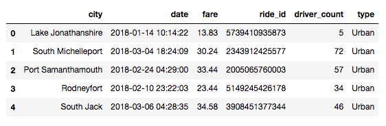
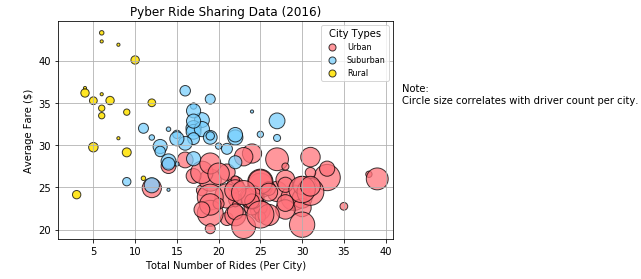
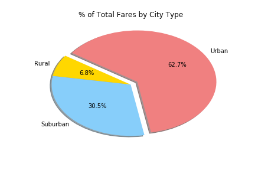
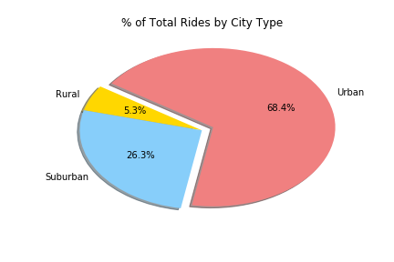
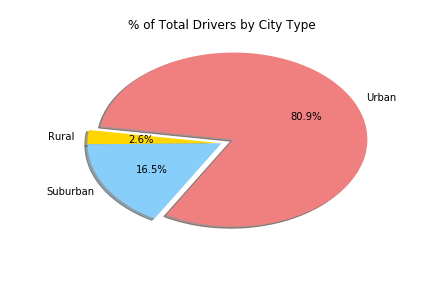

# The Power of Plots

## Pyber - Background

The ride sharing bonanza continues! Seeing the success of notable players like Uber and Lyft, you've decided to join a fledgling ride sharing company of your own. In your latest capacity, you'll be acting as Chief Data Strategist for the company. In this role, you'll be expected to offer data-backed guidance on new opportunities for market differentiation.

You've since been given access to the company's complete recordset of rides. This contains information about every active driver and historic ride, including details like city, driver count, individual fares, and city type.

## Ojbectives

#### Combine/Merge the two dataframes into a single dataset based on the cities they share

Build a Bubble Plot that showcases the relationship between four key variables:

* Average Fare ($) Per City
* Total Number of Rides Per City
* Total Number of Drivers Per City
* City Type (Urban, Suburban, Rural)

In addition, produce the following three Pie Charts:

#### % of Total Fares by City Type

#### % of Total Rides by City Type

#### % of Total Drivers by City Type

## Considerations

* Stick to the Pyber color scheme (Gold, Light Sky Blue, and Light Coral) in producing the plot and pie charts
* When making the Bubble Plot, experiment with effects like `alpha`, `edgecolor`, and `linewidths`
* When making the Pie Chart, experiment with effects like `shadow`, `startangle`, and `explosion`

## Observable Trends

* Pyber's ride sharing data for 2016 indicates that drivers in urban areas serviced more total number of riders compared to suburban drivers, and even less than rural drivers. While this may be the case, rural areas produced a higher average fare than suburban and urban areas, which directly correlates to the total number of rides. The data illustrates that the average fare, number of rides and drivers available vary by each developed environment.

* Urban areas naturally possess a high population density, contrary to rural areas with a low population density, and suburban areas being somewhere in the middle. The bubble chart suggests that due to the nature of the above mentioned areas, rural drivers drove longer distances than suburban and urban drivers, albeit the latter with more frequency, to get from pickup to destination. The data also reveals that urban drivers would have more competition than suburban and rural drivers, considering the driver count per city, resulting in a form of market saturation which can subsequently lead to a lower price structure, and therefore a lower profit margin. A key takeaway would be to determine where the settlements with a high demand for rides are with a disproportionately small number of drivers, and meet that demand; particularly in certain suburban areas.

* The three pie charts that display “% of Total Fares by City Type”, "% of Total Rides by City Type" and "% of Total Drivers by City Type" conclusively show that rural areas have higher fare totals in relation to total rides and drivers than suburban and urban areas. While urban areas had more drivers and serviced more rides, the average fare was smaller, which could lead to lower profit margins, even though it accounted for 62.7% of revenue.
